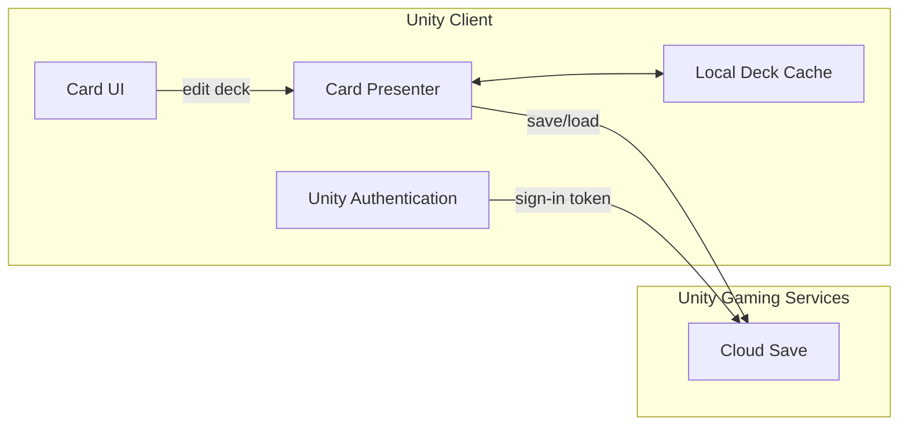
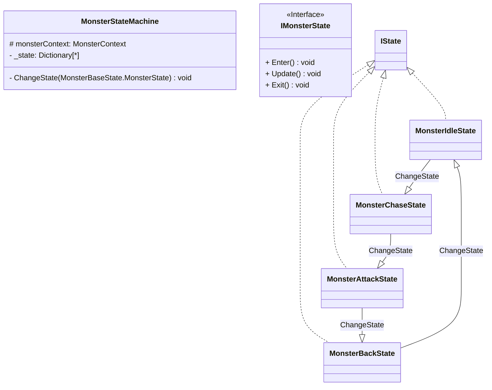

# Unity2D DunGeon Game
> 본 프로젝트는 2D 던전게임과 실시간 카드 게임을 합친다는 컨셉을 바탕으로, 플레이어가 덱을 구성하여 실시간 전투를 통해 몰입할 수 있도록 제작되었습니다.

## 프로젝트 개요
- **플랫폼**: Windows
- **엔진**: Unity 6 (6000.2.12.f1)(URP)
- **개발 기간**: 2025.05 ~ 진행 중
- **개발 도구**: C#
- **버전 관리**: Git, GitHub
- **데이터 관리**: Excel -> CSV -> Unity ScriptableObject, Unity Gaming Service Cloud Save(Unity Gaming Service)
- **아키텍쳐 패턴**: MVP
- **개발 인원**: 개인 프로젝트

## 구현상세 
#### 1. **카드 시스템 구현**
- **데이터 테이블 파싱**: 데이터 테이블은 게임 내 수치의 반복적인 수정과 방대한 양의 데이터를 다룸에 있어 이점을 가지므로, 기획자가 제작한 데이터 테이블을 CSV 데이터로 변환하여 스크립터블 오브젝트에 넣을 수 있도록 코드를 작성했습니다.
- **스크립터블 오브젝트**: 유니티의 스크립터블 오브젝트는 구조가 같은 대량의 서로 다른 오브젝트를 다루는데에 용이한 유니티의 **데이터 컨테이너**로, 복수의 데이터를 빠르게 **에셋**으로 만드어 저장하여 사용할 수 있다는 이점이 있습니다. 이에 본 프로젝트에서는 스크립터블 오브젝트를 이용하여 프로젝트의 핵심 시스템인 '카드 시스템'에 필요한 카드를 간편하고 빠르게 제작했습니다.
  - MonoBehavior, C# 오브젝트와의 차이점
    - MonoBehavior: MonoBehavior 클래스를 상속받는 스크립트는 기본적으로 유니티의 GameObject와 Transform 클래스를 상속받게 되어 단순 컨테이너를 구현할 때에는 메모리 공간 효율에 있어 단점을 갖습니다.
    - C#:C# 클래스로 정의된 데이터 컨테이너는 new 키워드로 인스턴스를 생성하며 생성자를 이용하여 데이터를 초기화해야 한다는 단점을 갖습니다.
- **데이터 베이스 저장**: 본 프로젝트는 UGS(Unity Gaming Service)의 Cloud Save를 이용하여 플레이어가 게임 내에서 저장한 카드 덱을 게임 로드 시에 서버로부터 불러올 수 있도록 코드를 작성했습니다. 이 과정에서 서버와 클라이언트의 동시성 제어를 위해 비동기 프로그래밍 개념을 학습하였습니다.

- **Fisher–Yates Shuffle 알고리즘을 이용한카드 덱 순환 시스템**: Fisher–Yates Shuffle 알고리즘은 리스트(배열) 범위 내에서 선택된 요소를 리스트의 마지막 요소와 자리를 교환시킨 후, 다음 시행에서는 알고리즘이 적용되는 리스트 범위를 한 칸 줄임으로써, 리스트의 요소를 한 방향에서부터 확정시켜 기존의 List.Sort()와 Random.Range()메서드를 이용하여 구현하는 셔플 방식이 갖는 확률의 불균등한 분포 문제를 해결할 수 있습니다. 또한, Fisher–Yates Shuffle 알고리즘은 연산 과정에서 임시 리스트(배열), 복사 등의 작업이 발생하지 않음으로 공간 복잡도가 O(1)이고, 셔플과정에서 각 연산이 한 번씩만 수행되기 때문에 시간 복잡도가 O(N)이므로 메모리 사용 및 GC부담을 줄일 수 있다는 점에서도 이점을 갖습니다. 이에 본 프로젝트에서는 카드 덱을 '사용 전', '사용 후' 카드 리스트와 각 키에 할당되는 '사용 중' 배열로 구성하여, 이를 Fisher–Yates Shuffle 알고리즘을 이용하여 구현하였습니다. 

#### 2. 오브젝트 풀링을 통한 최적화
- **오브젝트 풀링**: 오브젝트풀 패턴은 메모리를 할당하는 New는 사용하지만, 반납하는 Delete(GC)는 사용하지 않음으로서 메모리 공간 및 성능 저하를 방지하는 기법으로, 유니티의 경우 Instantiate()메서드로 복수의 게임 오브젝트를 미리 생성하고, 게임 오브젝트가 파괴되는 판정이 발생할 시 이를 Destroy()를 이용하여 삭제하는 것이 아닌 SetActive(false)로 생성된 게임 오브젝트를 풀에 보관하여 재사용하는 방식으로 구현합니다. 본 프로젝트에서는 몬스터 오브젝트와 UI의 카드 오브젝트를 오브젝트 풀링으로 구현하였습니다.
- **힙 메모리 효율성**: Instantiate()메서드는 호출과정에서 힙에 메모리를 할당하는데, 이때 오브젝트 풀링을 통해 필요한 메모리를 미리 할당함으로서 낭비되는 메모리 공간을 줄일 수 있도록 구현했습니다.
- **Garbage Collection 대상을 줄임**: C#의 경우 .NET 런타임의 Garbage Collector를 이용하여 더이상 참조하지 않는 객체를 자동으로 수거하여 메모리 공간에서 삭제하는 순간 게임 로직을 실행 중인 스레드가 멈추는 GC 스파이크가 발생하게 됩니다. 때문에 오브젝트 풀링을 통해서 가비지 컬렉터의 실행을 줄임으로서 런타임 중지를 방지했습니다.

#### 3. 몬스터 인공지능
- **FSM**: FSM은 객체의 상태를 추상화하여 나누고 전이함수를 통해 상태 변화를 제어하는, 가장 기초적인 게임 인공지능 제작 기법입니다.
  - 구현: 몬스터의 상태를 `MonsterIdleState`, `MonsterChaseState`, `MonsterAttackState`, `MonsterBackState`로 나누어 `MonsterStateMachine`을 통해 전이함수를 구현하였습니다.

- **팩토리 패턴을 이용한 오브젝트 생성**: 
#### 4. 기타
- 플레이어 이동 구현: 플레이어의 이동은 Unity6부터 기본으로 탑재된 InputAction Package를 사용하여 구현하였습니다. InputAction Package는 입력을 게임 로직과 분리하고 이를 액션 단위로 추상화하여 조작기기 변경 시 바인딩을 코드 수정없이, 입력 발생 시 콜백을 통해 이동 로직이 실행되도록 구현하였습니다.
- CineMachine?
- 싱글톤 게임 매니저

## 기술적 포인트 & 문제해결
- 문제 원인-->해결방안-->개념학습 순으로 정리할 것(구체적 분석과 해결 방법 제시-->프로파일러를 이용하여 수치기반 분석, 특정 기법 도입 명시(오브젝트 풀링 등))
- 카드 덱 순환 시스템을 구현하는 과정에서 배열 및 딕셔너리 초기화 과정에서 문제가 발생함-->유니티의 객체 수명 주기(생명주기)에 대해 학습-->게임 매니저 클래스 및 인터페이스를 통해 각 객체들의 초기화 문제 해결
  - 유니티 메서드의 실행 순서: `Awake()`-->`OnEnable()`-->`Start()`-->`FixedUpdate()`-->`OnTrigger()`-->`OnCollision()`-->`Update()`-->`LateUpdate()`-->`OnDisable()`-->`OnDestroy()`

## 향후 개발 로드맵
- 유니티의 상속과 컴포지션 개념의 학습 및 적용(=둘의 차이점을 알고 이를 적극 반영하는 시스템 설계 및 구현)-->컴포넌트 조합만을 이용한 기능 구현?
- 씬 관리와 재사용 학습(+씬이 갖는 자원 소모 학습)
- 캔버스의 성능 이슈와 최적화 기법 학습
- 몬스터 인공지능의 경로탐색 알고리즘 구현 + 행동트리
- 싱글턴(게임 내 전역 상태를 관리하는 매니저 클래스 설계), 옵저버, 전략 디자인 패턴 사용해 보기
- Raycast활용
- 게임 시작, 일시정지, 종료의 구현 방식
- PlayerPrefs, 직열화...?
- 자료조사 경험 정리(=모르는 것을 어떻게 공부했는가?)
- API 연동시켜보기
- JsonUtility 사용 및 특성 정리(논문 참고)
- 유니티 프로파일러 사용해보기

## 메모
- 비동기 프로그래밍
  - 멀티 스레드
    - 멀티 스레드를 사용하게 되면, 각 스레드의 작업이 끝나는 순서를 알 수 없기 때문에 비동기 프로그래밍을 사용
  - C#의 비동기 프로그래밍
    - async: 비동기적인 작업(Task)을 처리할 수 있는 메서드->일반적으로 Task를 반환 
    - await: 비동기 작업(Task)이 완료될 때까지 메서드 실행을 일시중단 
    - Task: 반환 값 없는 비동기 메서드 작업을 나타내는 '객체'
    - Task<T>: T타입을 반환하는 
- 코루틴과의 차이: 코루틴은 쓰레드는 아니며, 코루틴은 타이머 기간 동안 다른 스레드에 보관
  - 유니티 내부(유니티의 메인 로직)에서 돌아간다는 장점이 있음
  

## Contact Me
- eMail: moonshine1004@naver.com
